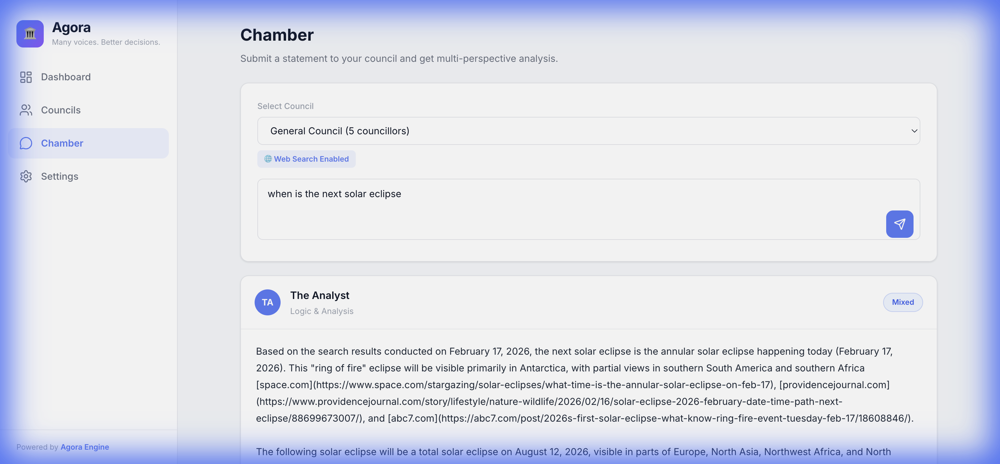
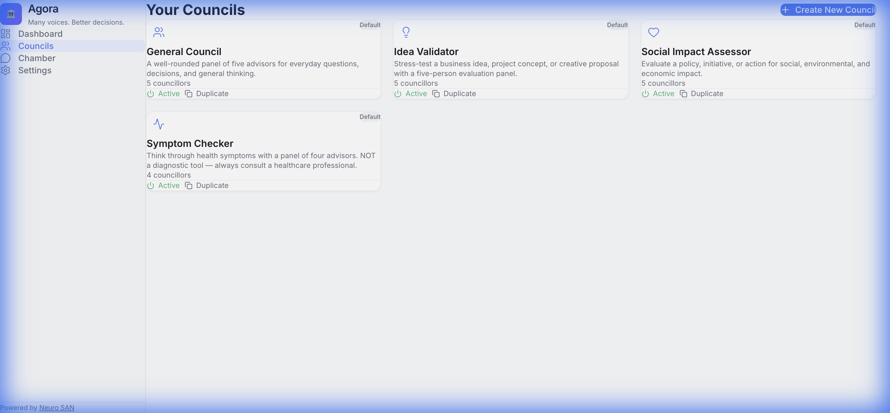
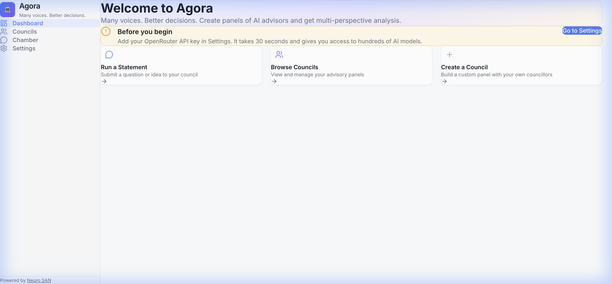

# 🏛️ Agora

> Many voices. Better decisions.

**Note:** This project is currently compatible with **macOS** and **Linux** environments. Windows support is not yet implemented.

Agora is a **neuro-symbolic council system** that leverages multiple LLM personas to deliberate on complex topics. It uses a structured debate format where specialized agents (Councillors) discuss a statement, critique each other, and reach a synthesized verdict.

## What is "Neuro-Symbolic"?
Agora combines the best of two worlds:
-   **Neuro (The Neural Networks / LLMs):** The raw intelligence and creativity of models like GPT-4, Claude, and DeepSeek.
-   **Symbolic (The Structured Logic):** Rigid code and specifications (`engine/`, `spec/`) that force the models to follow a strict debate procedure.

Result: **Structured, consistent reasoning** that outperforms unstructured chat.

---

## 🎨 User Interface

### The Chamber
Watch the debate unfold in real-time as agents take turns arguing, critiquing, and voting.


### Council Management
Create custom councils with unique personas (e.g., "The Pessimist", "The Data Scientist").


### Dashboard
Track all deliberations, costs, and token usage at a glance.


---

## Features

-   **Multi-Agent Deliberation**: Different personas argue from unique perspectives.
-   **OpenRouter Integration**: Access hundreds of LLMs via a single API.
-   **Free Model Support**: Works seamlessly with free models like **DeepSeek V3 (Free)** via OpenRouter.
-   **Local Privacy**: Custom council configurations and chat history are stored locally in SQLite (`data/agora.db`).
-   **Web Search**: Equip your council with real-time web search capabilities (requires OpenRouter models with online support).
-   **Cost Tracking**: Monitor token usage and costs per session.

## Getting Started

### Prerequisites

-   **Python 3.10+**
-   **Node.js 18+** (for building the frontend)
-   **OpenRouter API Key**: Get one at [openrouter.ai](https://openrouter.ai). (Many models are free!).

### Installation

1.  **Clone the repository**:
    ```bash
    git clone https://github.com/yourusername/agora.git
    cd agora
    ```

2.  **Run the installer**:
    ```bash
    ./install.sh
    ```
    This sets up a Python virtual environment, installs dependencies, and builds the React frontend.

3.  **Configure Environment**:
    Create a `.env` file in the root directory:
    ```bash
    echo "OPENROUTER_API_KEY=sk-or-v1-..." > .env
    ```

### Usage

Start the application:

```bash
./start.sh
```

Visit **http://localhost:8080** in your browser.

## Project Structure

-   `backend/`: Python FastAPI server and business logic.
-   `frontend/`: React + Vite application.
-   `engine/`: Core deliberation engine (pure Python, framework-agnostic).
-   `spec/`: HOCON specifications for councils.
-   `data/`: Local SQLite database (gitignored).

## Contributing

We welcome contributions! Please see `CONTRIBUTING.md` for details.

## License

MIT © 2026 Agora Contributors
